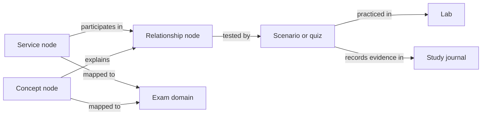

# AWS CloudOps knowledge graph

This is a lightweight, Markdown-first knowledge graph: pages are the nodes; labeled links in metadata and prose are the edges. The exam-domain pages remain the coverage map, while the study journal remains the source of truth for your progress and demonstrated understanding. No graph database or web app is needed to start.

## Knowledge layers

| Layer | What belongs here |
|---|---|
| [Services](services/README.md) | Canonical page for one AWS service and its operational behavior |
| [Concepts](concepts/README.md) | Cross-service principles and distinctions |
| [Relationships](relationships/README.md) | Explicit behavior or dependency between two or more nodes |
| [Scenarios](scenarios/README.md) | Original questions that test reasoning across linked nodes |
| [Labs](labs/README.md) | Hands-on work that observes or changes real AWS resources |
| [Cheatsheets](cheatsheets/README.md) | Short review aids derived from canonical pages, not competing copies |
| [Templates](templates/) | Starting formats for graph nodes, edges, and scenarios |

## Authoring rules

1. Give each service or concept one canonical page. Link to it instead of copying its explanation into domains, scenarios, or cheatsheets.
2. Every node states its SOA-C03 domain mapping and links to authoritative AWS sources. The current exam guide defines scope; AWS service documentation defines behavior.
3. Represent meaningful edges with a short, directional verb such as `routes-to`, `scales-with`, `measured-by`, `depends-on`, `protects`, or `contrasts-with`. Explain conditions and exceptions; a link alone does not prove causality.
4. Scenarios and future quiz questions must be original, link to the nodes they test, and explain why plausible alternatives do not fit. Do not copy exam dumps or another repository's prose/questions.
5. Add a Mermaid diagram only when it clarifies a multi-step flow or several relationships. Keep ordinary navigation as relative Markdown links so GitHub renders it.
6. Mark mutable facts with `last_verified` and re-check AWS defaults, limits, and behaviors against current official documentation before relying on them.
7. A page being read, linked, or used in a successful lab is not proof of mastery. Record learner evidence and mistakes in the [study journal](../../AWS-CLOUDOPS-STUDY.md) and the relevant [domain page](../domain-1-monitoring.md) without inflating the status.

The repo-local authoring workflow for agents is [`../../.agents/skills/aws-knowledge-graph/SKILL.md`](../../.agents/skills/aws-knowledge-graph/SKILL.md).

## Current seed topics

Start with what is already in the study record; create canonical pages as those topics are revisited rather than migrating everything at once:

- CloudWatch alarm states and evaluation — [Domain 1](../domain-1-monitoring.md)
- ALB target groups and health checks — [Domain 5](../domain-5-networking.md)
- RPO, backup cadence, and replication lag — [Domain 2](../domain-2-reliability.md)
- CLI → Console → OpenTofu comparison — [Domain 3](../domain-3-deployment.md)
