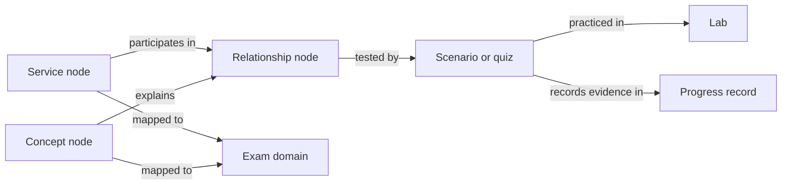

# AWS CloudOps knowledge graph

This is a lightweight, Markdown-first knowledge graph: pages are the nodes; labeled links in metadata and prose are the edges. The exam-domain pages remain the coverage map, while [`PROGRESS.md`](../../PROGRESS.md) is the source of truth for learner progress and demonstrated understanding. No graph database or web app is needed to start.

## Knowledge layers

| Layer | What belongs here |
|---|---|
| [Services](services/README.md) | Canonical page for one AWS service and its operational behavior |
| [Concepts](#services-and-concepts) | Cross-service principles and distinctions |
| [Relationships](relationships/README.md) | Explicit behavior or dependency between two or more nodes |
| [Scenarios](scenarios/README.md) | Original questions that test reasoning across linked nodes |
| [Labs](labs/README.md) | Hands-on work that observes or changes real AWS resources |
| [Cheatsheets](cheatsheets/README.md) | Short review aids derived from canonical pages, not competing copies |
| [Templates](templates/) | Starting formats for graph nodes, edges, and scenarios |

## Services and concepts

The separation is about the kind of knowledge being explained, not whether a topic matters to more than one exam domain. This adapts the upstream author's explanation in [“Why there are both services and concepts”](https://github.com/GabrielAlmeidaFlores/AWS-CloudOps-Engineer-Associate-Doc/blob/14fd84dd958b4bf5196f95645fbc6036646cdf3a/AGENTS.md#12-why-there-are-both-services-and-concepts).

- **A service page** answers: *What is this AWS service, and how do I operate it?* It is the canonical place for a named AWS service's resource model, configuration, operational behavior, failure modes, security boundaries, and costs.
- **A concept page** answers: *What general CloudOps principle applies across AWS?* It explains ideas such as IP addressing, routing, DNS, encryption, high availability, or recovery objectives. It should not turn into a manual for one AWS resource.
- **Relationships connect them.** A concept can explain behavior shared by several services; a relationship page documents a specific interaction between services or between a service and a concept. Link to canonical pages instead of repeating their explanations.

If a topic seems to fit both layers, keep service-specific behavior with the service and the cross-cutting principle with the concept, then link the two. IAM, for example, is a service; least privilege is a concept.

## Directory structure

The layout below follows the upstream taxonomy, but removes its top-level `01-services/` and `02-concepts/` wrappers because this repo already separates those layers directly under `knowledge/`. Only the IAM and IP-addressing upstream collections are currently present; add other topic directories as they become useful.

```text
knowledge/
├── README.md
├── upstream-sources.yml
├── services/
│   ├── README.md
│   └── 13-security-identity-compliance/
│       └── 01-iam/                         # imported upstream service notes
├── concepts/
│   ├── 01-networking/
│   │   ├── 01-ip-addressing/               # imported upstream concept notes
│   │   ├── 02-ipv4-ipv6/
│   │   ├── 03-dns/
│   │   ├── 04-routing/
│   │   ├── 05-private-connectivity/
│   │   ├── 06-hybrid-connectivity/
│   │   └── 07-network-troubleshooting/
│   ├── 02-security/
│   │   ├── 01-iam/
│   │   ├── 02-policies/
│   │   ├── 03-roles/
│   │   ├── 04-resource-policies/
│   │   ├── 05-least-privilege/
│   │   ├── 06-encryption/
│   │   ├── 07-kms/
│   │   ├── 08-certificates/
│   │   ├── 09-secrets/
│   │   └── 10-compliance/
│   ├── 03-observability/
│   │   ├── 01-metrics/
│   │   ├── 02-logs/
│   │   ├── 03-events/
│   │   ├── 04-alarms/
│   │   ├── 05-dashboards/
│   │   ├── 06-tracing/
│   │   └── 07-remediation/
│   ├── 04-reliability/
│   │   ├── 01-high-availability/
│   │   ├── 02-fault-tolerance/
│   │   ├── 03-elasticity/
│   │   ├── 04-scalability/
│   │   ├── 05-backups/
│   │   ├── 06-disaster-recovery/
│   │   ├── 07-rto-rpo/
│   │   └── 08-failover/
│   ├── 05-automation/
│   │   ├── 01-infrastructure-as-code/
│   │   ├── 02-cloudformation/
│   │   ├── 03-cdk/
│   │   ├── 04-systems-manager/
│   │   ├── 05-event-driven-automation/
│   │   └── 06-operational-automation/
│   ├── 06-performance/
│   │   ├── 01-compute/
│   │   ├── 02-storage/
│   │   ├── 03-databases/
│   │   ├── 04-caching/
│   │   └── 05-network-performance/
│   └── 07-cost/
│       ├── 01-pricing-models/
│       ├── 02-cost-optimization/
│       ├── 03-network-costs/
│       ├── 04-storage-costs/
│       └── 05-compute-costs/
├── relationships/
├── scenarios/
├── labs/
├── cheatsheets/
└── templates/
```

This is a progressive guide, not a requirement to create every directory now. Keep each folder's `README.md` as its unnumbered entry point where a folder-specific index is useful.

## Imported upstream notes

Two upstream-authored collections are included here with the author's explicit permission for **personal study use only**: [IP-addressing concept notes](concepts/01-networking/01-ip-addressing/README.md) and [IAM service notes](services/13-security-identity-compliance/01-iam/README.md). All 16 files were SHA-256 verified against upstream revision `14fd84d` at import. During flattening, filenames were preserved; the two collection README files were adapted for local navigation and graph conventions, and one link to a topic not present locally was changed to a forward reference. The other 13 files remain unchanged.

- Source: [GabrielAlmeidaFlores/AWS-CloudOps-Engineer-Associate-Doc](https://github.com/GabrielAlmeidaFlores/AWS-CloudOps-Engineer-Associate-Doc)
- The upstream repository declares no license. The author directly authorized this copy for personal study; attribution is required, but commercial use or redistribution is not granted.
- [`upstream-sources.yml`](upstream-sources.yml) records the pinned source paths and revision, the reported permission scope, and the local path mapping for future syncs.



## Authoring rules

1. Give each service or concept one canonical page. Link to it instead of copying its explanation into domains, scenarios, or cheatsheets.
2. Every node states its SOA-C03 domain mapping and links to authoritative AWS sources. The current exam guide defines scope; AWS service documentation defines behavior.
3. Represent meaningful edges with a short, directional verb such as `routes-to`, `scales-with`, `measured-by`, `depends-on`, `protects`, or `contrasts-with`. Explain conditions and exceptions; a link alone does not prove causality.
4. Scenarios and future quiz questions must be original, link to the nodes they test, and explain why plausible alternatives do not fit. Do not copy exam dumps or another repository's prose/questions.
5. Add a Mermaid diagram only when it clarifies a multi-step flow or several relationships. Keep ordinary navigation as relative Markdown links so GitHub renders it.
6. Mark mutable facts with `last_verified` and re-check AWS defaults, limits, and behaviors against current official documentation before relying on them.
7. A page being read, linked, or used in a successful lab is not proof of mastery. Record learner evidence and mistakes in [PROGRESS.md](../../PROGRESS.md) and the relevant [domain page](../domain-1-monitoring.md) without inflating the status.

The repo-local authoring workflow for agents is [`../../.agents/skills/aws-knowledge-graph/SKILL.md`](../../.agents/skills/aws-knowledge-graph/SKILL.md).

## Current seed topics

Start with what is already in the study record; create canonical pages as those topics are revisited rather than migrating everything at once:

- CloudWatch alarm states and evaluation — [Domain 1](../domain-1-monitoring.md)
- ALB target groups and health checks — [Domain 5](../domain-5-networking.md)
- RPO, backup cadence, and replication lag — [Domain 2](../domain-2-reliability.md)
- CLI → Console → OpenTofu comparison — [Domain 3](../domain-3-deployment.md)
