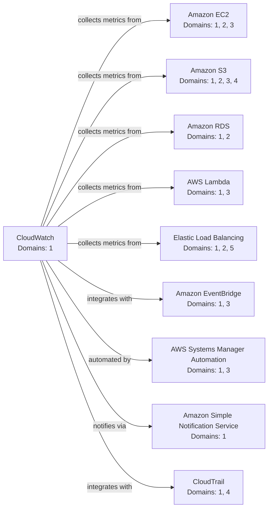
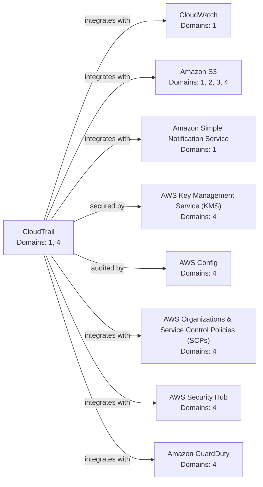
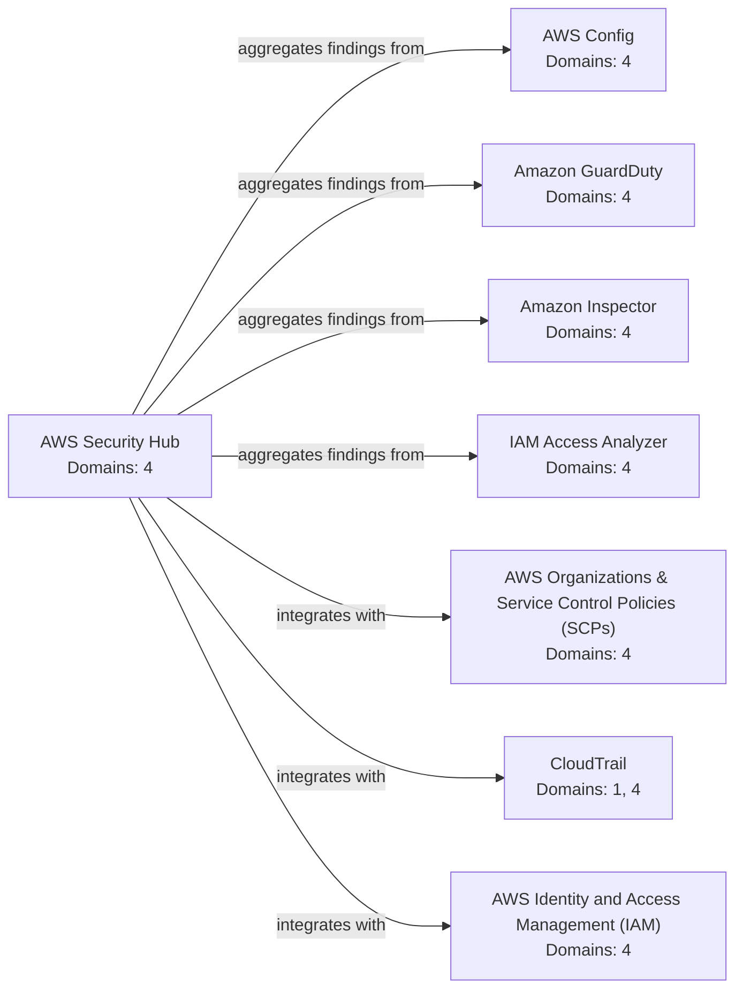
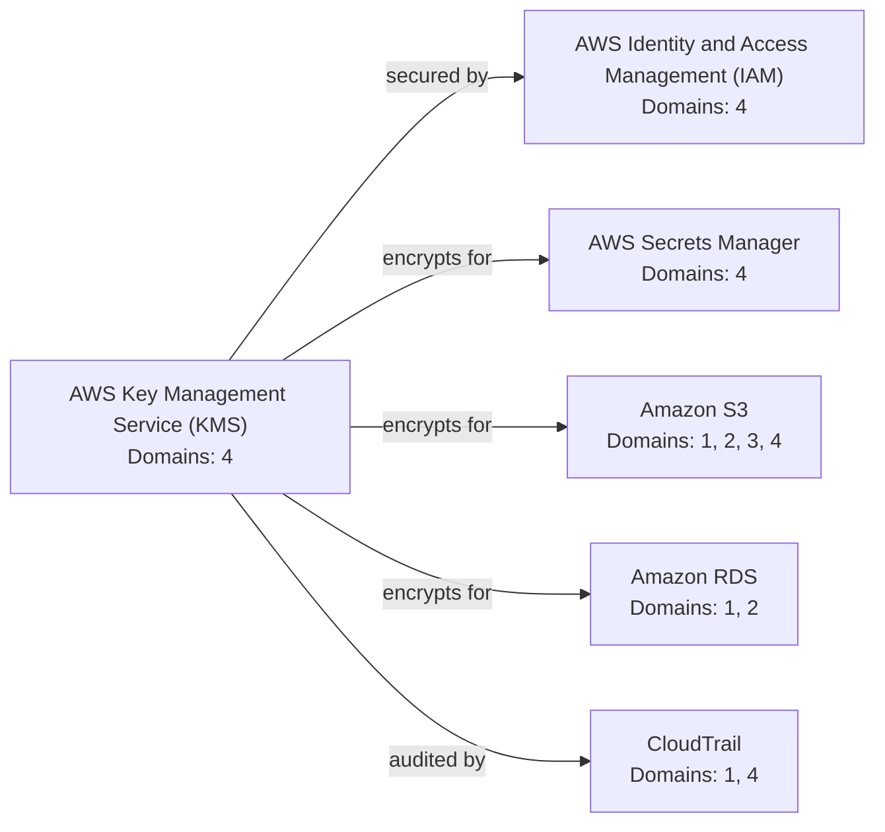

<!-- Generated by tools/generate-service-graph.py; do not edit manually. -->
# Service relationship atlas

> [!NOTE]
> This is a derived view of canonical service front matter. The four focused diagrams favor readable study paths over an unreadable all-edges chart; do not use this file as the source of truth.

19 canonical service nodes and 41 directed, typed relationships.

Each arrow reads left to right: `source --relation--> target`. Only outgoing edges from the named hub are included in each focused view.

## Regenerate

```bash
mise run graph:generate
mise run graph:check
```

## Monitoring and response

[Open the static SVG](service-graph-cloudwatch.svg) (10 nodes, 9 edges).



## Audit paths

[Open the static SVG](service-graph-cloudtrail.svg) (9 nodes, 8 edges).



## Security findings

[Open the static SVG](service-graph-securityhub.svg) (8 nodes, 7 edges).



## Data protection

[Open the static SVG](service-graph-kms.svg) (6 nodes, 5 edges).


